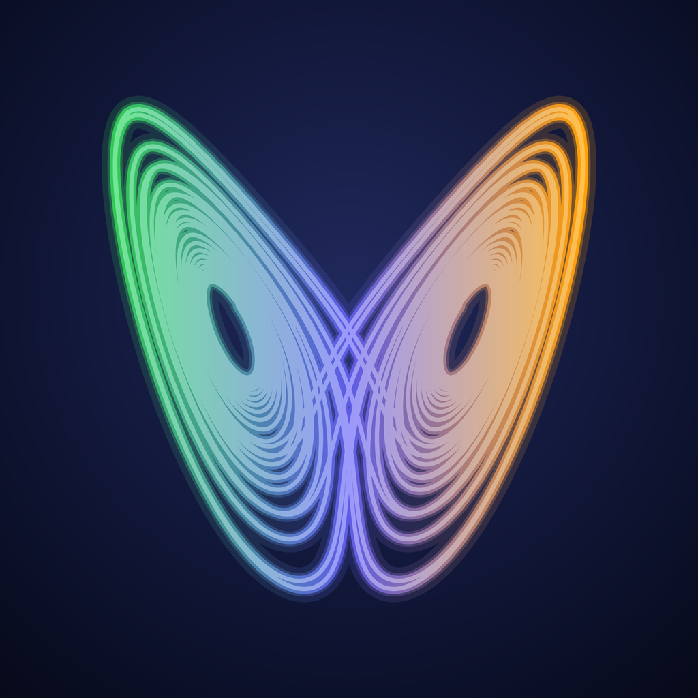
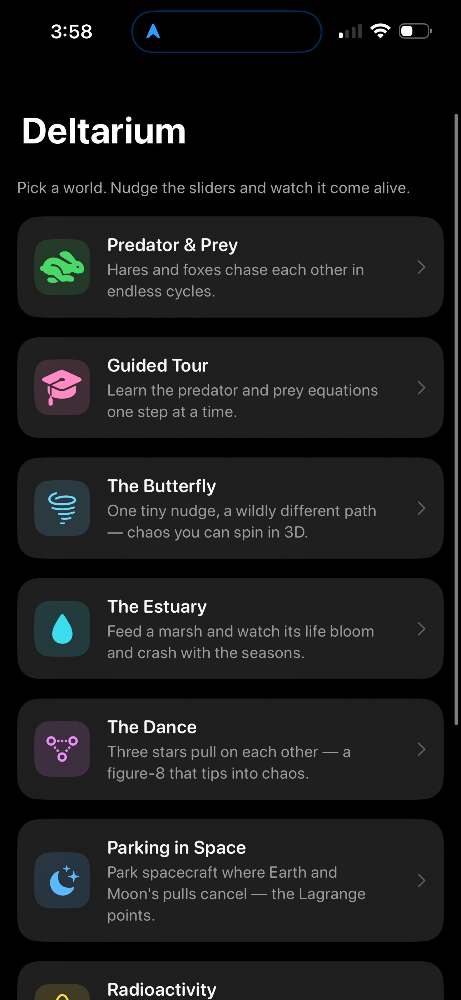
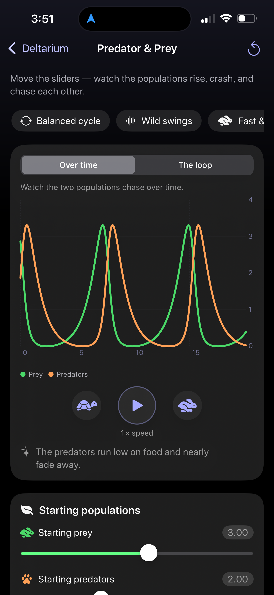
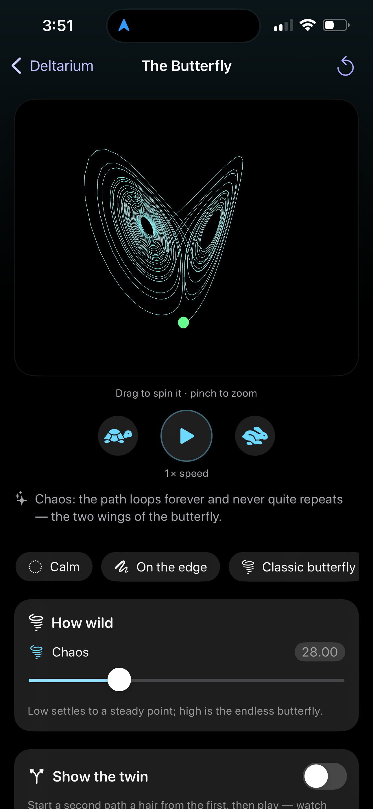
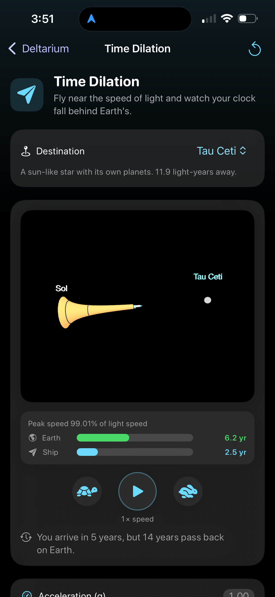
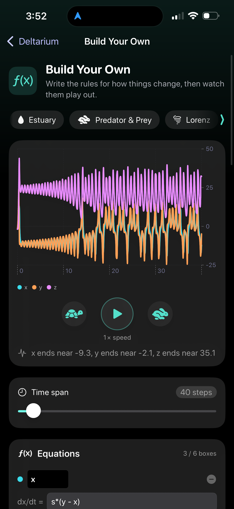

<p align="center">
  
</p>

<h1 align="center">Deltarium</h1>

A teaching app for the mathematics of change. You open a world, move a few
sliders, press play, and watch a system evolve on your phone: rabbits and foxes
rising and falling, a chaotic attractor tracing its wings, a rocket bending time
on its way to another star. Built for kids and curious people first, and for
scientists too.

Deltarium is the iPhone front end of **EasyModeler**, a small system for running
ordinary differential equation models. The name is a nod to a planetarium: a
place to walk among worlds, where the delta is the differential math each world
teaches.

<p align="center">
  
</p>

## The worlds

<p align="center">
  
  
  
  
</p>

<p align="center"><em>Predator and Prey · The Butterfly · Time Dilation · Build Your Own</em></p>

- **Predator and Prey.** The classic hare-and-lynx cycle. Set the birth,
  hunting, and dying rates and watch the populations chase each other around a
  loop.
- **The Butterfly.** The Lorenz attractor in 3D that you can spin with a finger.
  Turn on the twin path, which starts a hair away from the first, and watch the
  two separate. The butterfly effect you can see.
- **Estuary.** A coastal model of nutrients and life that blooms and crashes with
  the seasons.
- **The Dance.** Three stars pulling on each other, including the famous
  figure-eight where they chase one another forever.
- **Parking in Space.** The five Lagrange points, the spots where a small craft
  can hold its place relative to the Earth and Moon. Give all five a shared kick
  and see which ones stay parked and which wander off.
- **Radioactivity.** How a radioactive source fades over time, following the real
  decay chain from a parent down through its daughters.
- **Time Dilation.** A rocket that holds a steady one gravity of thrust all the
  way to a distant star, flipping over at the midpoint to slow down. The clock on
  the ship and the clock back on Earth pull apart. Relativity, drawn as a
  worldtube that pinches where the ship runs fastest.
- **Build Your Own.** Write your own equations, add sliders for the parts you
  want to tune, and watch the system run. This is where the app earns its keep.

There is also a guided tour that walks through the predator and prey model one
step at a time.

## Where it fits

Deltarium is tier 1 of the EasyModeler system, which runs the same models at
three levels:

1. **On the phone (this repo).** A pure-Swift engine that solves the equations on
   device, with no network and no data collection.
2. **The reference.** The Python `easymodeler` package, the ground truth the
   phone's math is measured against. Its numbers come from a version proven
   bit-for-bit against the original 2016 engine.
3. **Online follow-along (later).** The phone calling a hosted copy of the real
   Python package for heavier or authoritative work.

The phone engine is checked against that reference for every model. It is not
identical to the reference down to the last bit, and it is not meant to be.
Chaotic systems like Lorenz pull apart no matter how careful the arithmetic, and
that pulling-apart is the lesson itself. The contract is a close match over a
short horizon plus the physical checks that must always hold, such as conserved
energy or a conserved atom count.

## Layout

- `EasyModelerKit/` is the pure-Swift ODE engine. It builds and runs its tests on
  Linux and in CI, with no Apple frameworks.
- `App/` is the SwiftUI app: the worlds, the charts, the 3D scenes, and the
  transport controls.
- `docs/` holds the plans, the toolchain notes, and the conventions this repo
  follows.
- `tools/` holds the Python scripts that freeze the reference numbers the Swift
  tests measure against.

## Build the engine

```bash
cd EasyModelerKit
swift build
swift test
swift format lint --strict --recursive Sources Tests
```

The app itself is built and signed from Linux with
[xtool](https://github.com/xtool-org/xtool) and Swift 6.3.3, with no Mac in the
loop. The toolchain notes are in [`docs/XTOOL.md`](docs/XTOOL.md), and the whole
system and roadmap are in [`docs/SYSTEM_PLAN.md`](docs/SYSTEM_PLAN.md).

## Privacy

Deltarium runs entirely on your device. It has no network calls, no accounts, no
ads, and no analytics. It collects nothing.

## License

MIT, see [LICENSE](LICENSE). The Python `easymodeler` engine is a separate
project, also under the MIT license.
